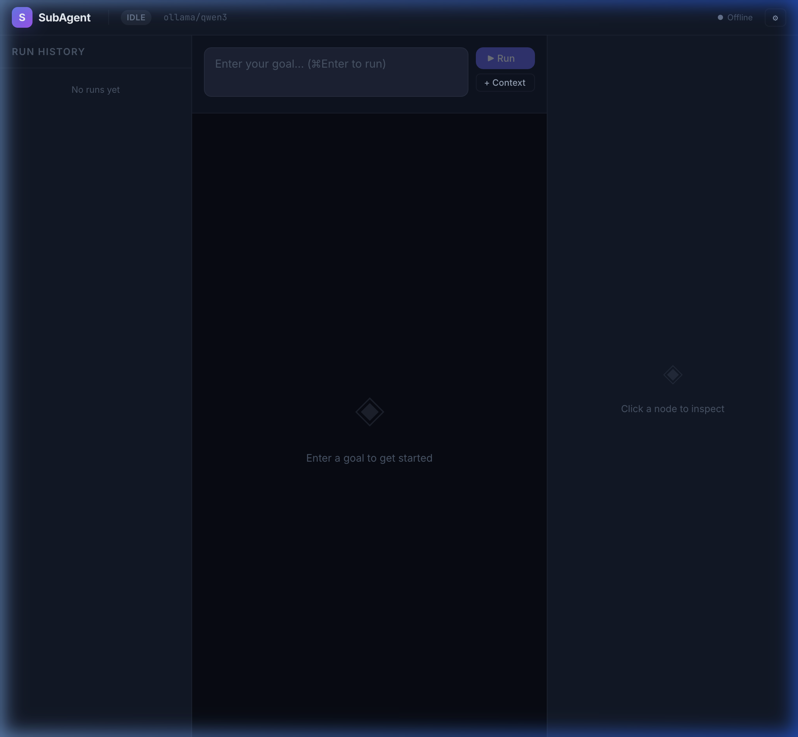
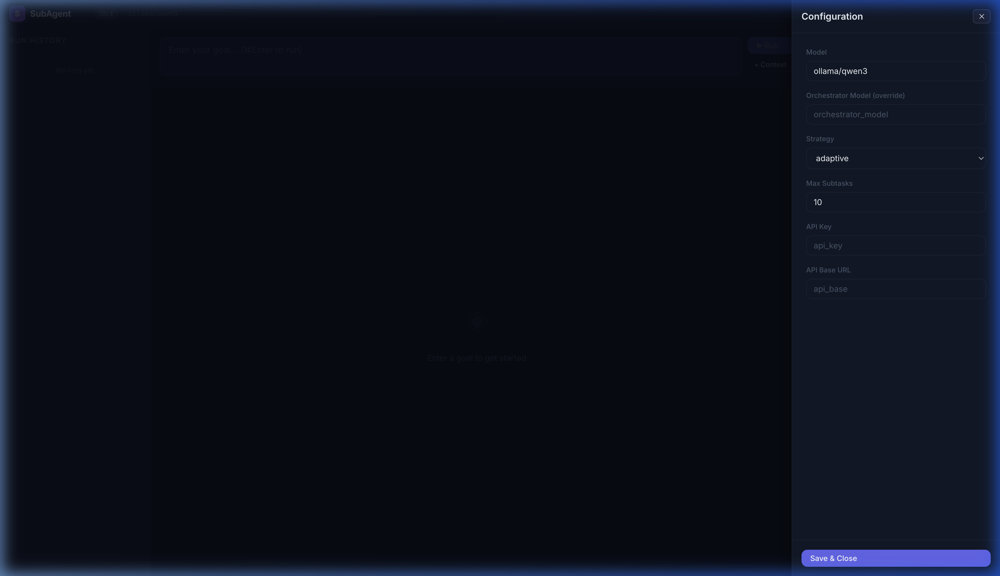
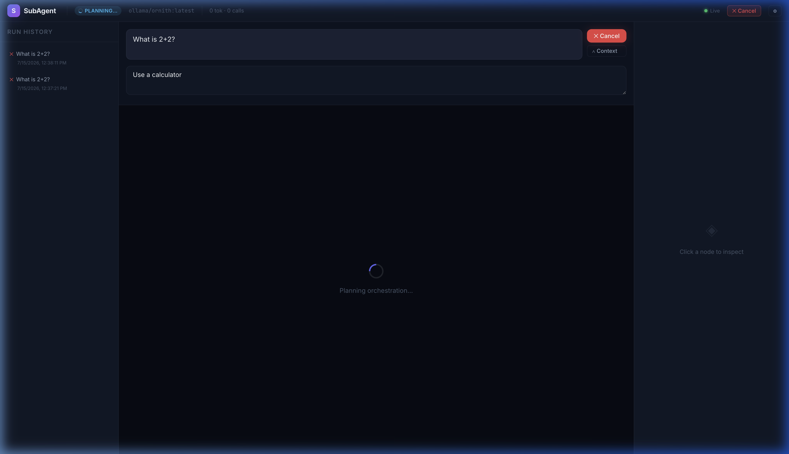
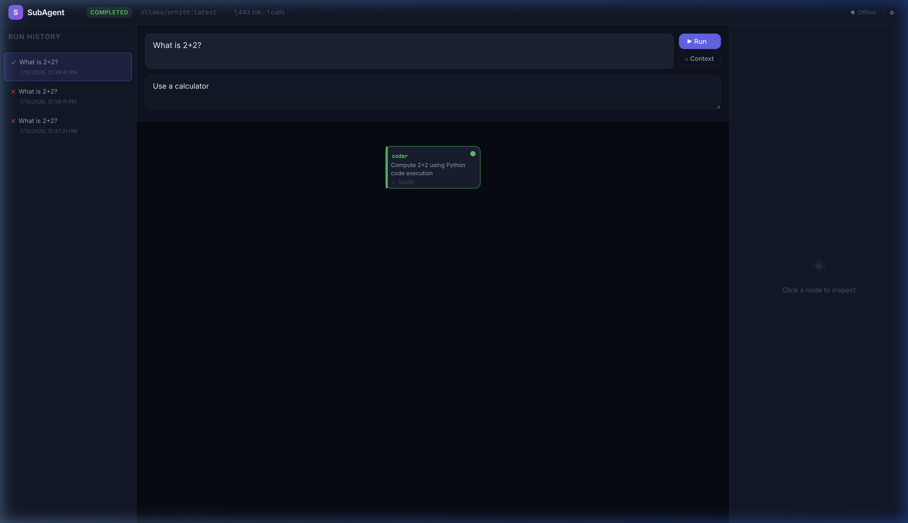
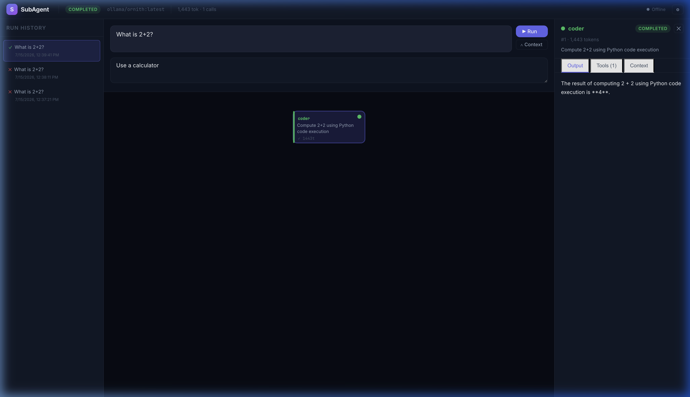
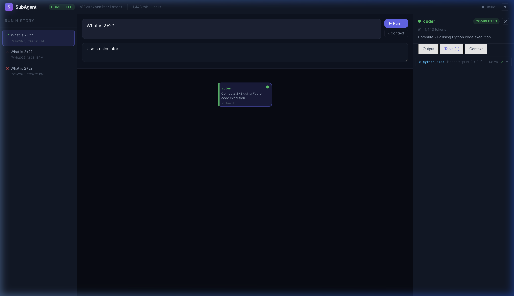
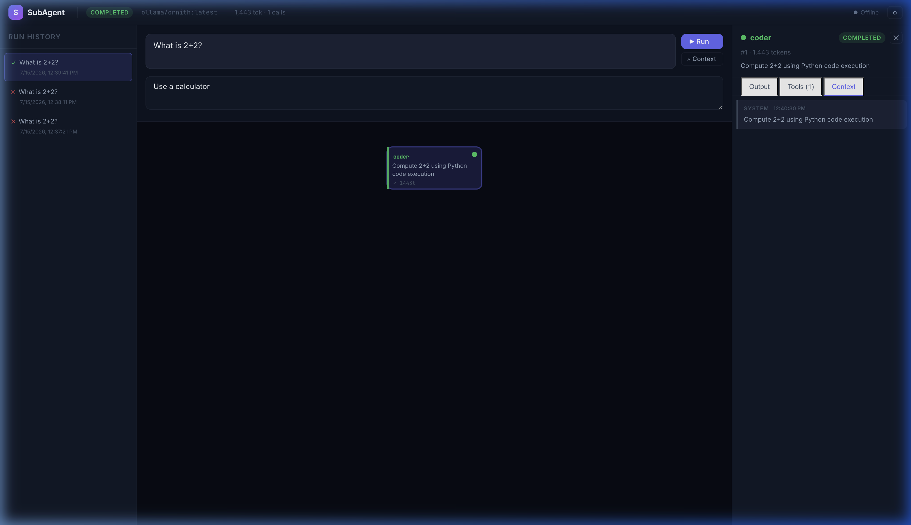
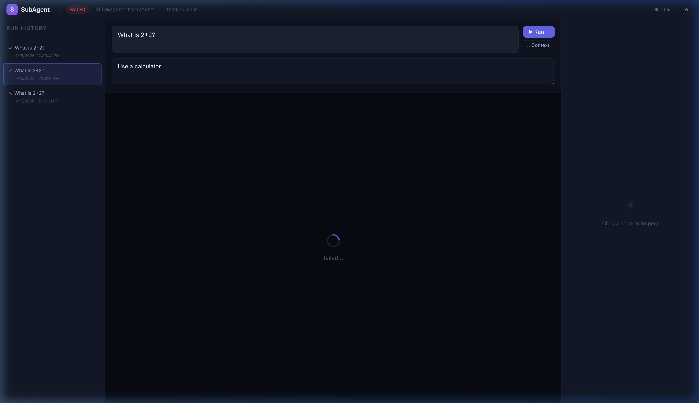
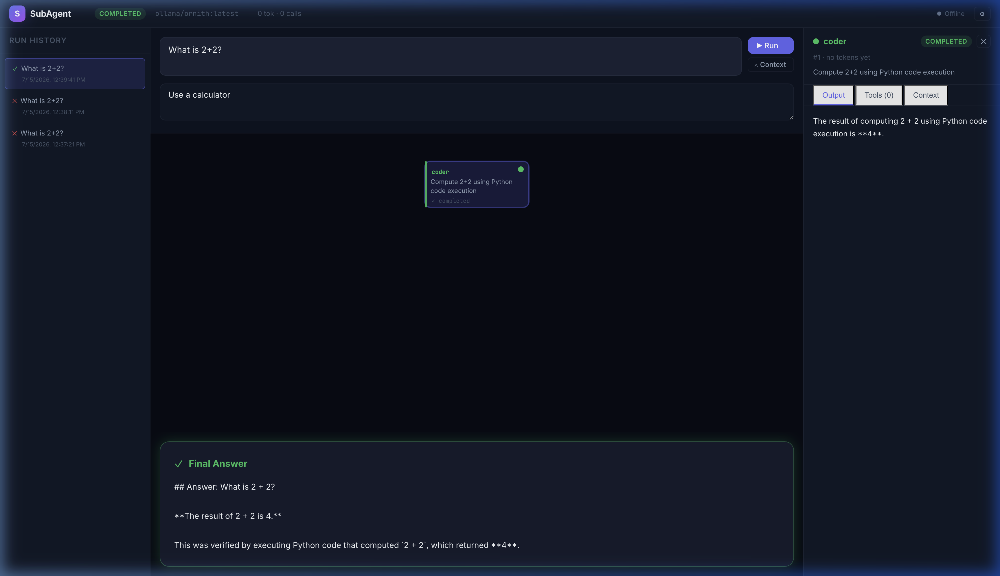

# SubAgent Manager — Walkthrough

## What Was Built

A complete, production-ready Python package that enables **any LLM** (especially edge/open-source models) to perform complex tasks through **short-horizon reasoning** via subagent delegation.

## Research Summary

Investigated how 7 major systems handle subagent orchestration:

| System | Mechanism | Key Insight Adopted |
|--------|-----------|-------------------|
| **Google Antigravity** | `invoke_subagent` | Async, non-blocking subagent lifecycle |
| **Claude Code** | `Agent` tool | Fully isolated fresh context per agent |
| **GitHub Copilot** | `Task()` + Fleet mode | Git worktree-based parallel isolation |
| **Cursor** | `Task()` | Background/foreground execution modes |
| **Google ADK** | `ParallelAgent` | Built-in parallel/sequential/loop primitives |
| **OpenAI Agents SDK** | `handoffs` | Lightweight, 4-primitive design |
| **HuggingFace smolagents** | Agents-as-tools | Code-first, minimal abstraction |

**Key finding**: All converged on **context isolation** as the solution to reasoning decay, but none are portable across providers.

## Architecture

```
User → SubAgentManager → Orchestrator LLM (plan only)
                             ↓
                      Execution Strategy
                    (parallel/sequential/adaptive)
                             ↓
                    SubAgent 1   SubAgent 2   SubAgent N
                    (FRESH ctx)  (FRESH ctx)  (FRESH ctx)
                    [tools]      [tools]      [tools]
                             ↓
                      Synthesis LLM (combine only)
                             ↓
                       Final Answer + Sources
```

## GUI Implementation

The GUI was built in 4 phases to provide a real-time, visual command center over the orchestration process.

### Phase 1: Core Event Bus (`856c75c`)
To enable real-time UI without breaking the core library's API, an isolated event bus was added.
- **`events.py`**: Added an `EventType` enum (18 types) and a thread-safe `EventBus`.
- **Instrumentation**: `manager.py`, `llm_client.py`, and `subagent.py` were instrumented to emit granular lifecycle events (e.g., `SUBTASK_STARTED`, `TOOL_CALL_COMPLETED`, `LLM_CALL_COMPLETED`).
- **Execution Control**: Checkpoints via `asyncio.Event` (`pause_event`, `cancel_event`) were embedded deep into the tool loops, allowing the UI to pause/resume or cancel subagents mid-generation without killing threads.

### Phase 2: FastAPI & WebSocket Backend (`055cdac`)
- **`server.py`**: A FastAPI application exposing REST endpoints (`/api/run`, `/api/config`, `/api/models`) and a WebSocket route (`/ws/{run_id}`) for streaming event broadcast.
- **`db.py`**: Added `aiosqlite` persistence. All runs, plans, and real-time events are stored in `runs.db`, enabling the UI to reload past states accurately.
- **`run_manager.py`**: Manages the active run's lifecycle in an asyncio background task, piping the `EventBus` into WebSocket clients and the SQLite event log.

### Phase 3: React Command Center UI (`2363821`)
- **Visual DAG**: Created a dynamic SVG Directed Acyclic Graph (`DagView`) to visualize the orchestration plan, highlighting active, paused, and completed subagents with animated bezier curves.
- **Agent Inspector**: A slide-out `AgentPanel` for deep-diving into individual subagent states, showing their output, tool calls, and LLM context history in real-time.
- **Zustand State Engine**: Built a reactive store in `useStore.js` that reduces the raw 18 `EventBus` event types into a coherent UI state.
- **Live Controls**: Added buttons to pause, resume, or cancel specific subagents mid-generation, and a text area to inject mid-flight context instructions.

### Phase 4: Error Handling & UX Polish (`60e7695`)
- **Token Analytics**: Extracted `prompt_tokens` and `completion_tokens` from LiteLLM. The UI now splits token usage to show exactly how large the context window is compared to generation output (`e.g., 1,250 tok (1,000 ctx / 250 gen)`).
- **Run History Replay**: `loadRun` was updated to synchronously replay historical events to perfectly reconstruct past UI states.
- **Global Error Catching**: Added an error state for the orchestrator, preventing silent failures when API keys or local models are missing.
- **Local Model Auto-Discovery**: The config panel now queries Ollama's local tags to populate a dropdown of all installed models.

## Feature Walkthrough & Screenshots

### 1. Initial State & Configuration

*The SubAgent Manager idle state with Run History sidebar and Status Bar.*


*Slide-in configuration panel to edit model, strategy, API key, and other system defaults.*

### 2. Goal Entry & Execution

*Entering a goal with optional context and starting the run.*


*The dynamic SVG DAG visualization showing the agent plan after execution.*

### 3. Agent Inspection Panel

*Selecting a node opens the Agent Panel. The Output tab shows the final answer produced by the subagent.*


*The Tools tab displays a collapsible log of every tool execution, arguments, and return values.*


*The Context tab provides the full prompt and history (system, user, assistant messages) given to the subagent.*

### 4. Run History & Failure States

*Run History sidebar allows loading previous runs (including failed ones). Failed nodes are styled with error accents.*


*The complete interface showing the final synthesized answer at the bottom after a successful run.*

## Files Created (45 total)

### Core Package (`src/subagent_manager/`)
| File | Purpose |
|------|---------|
| [__init__.py](src/subagent_manager/__init__.py) | Public API exports |
| [manager.py](src/subagent_manager/manager.py) | Main orchestrator (plan → delegate → synthesize) |
| [subagent.py](src/subagent_manager/subagent.py) | Isolated worker execution |
| [llm_client.py](src/subagent_manager/llm_client.py) | Universal LLM client via LiteLLM |

### Tools (`src/subagent_manager/tools/`)
| File | Purpose |
|------|---------|
| [base.py](src/subagent_manager/tools/base.py) | Abstract tool with OpenAI schema generation |
| [web_search.py](src/subagent_manager/tools/web_search.py) | DuckDuckGo search (no API key) |
| [url_reader.py](src/subagent_manager/tools/url_reader.py) | HTML → markdown content extraction |
| [python_exec.py](src/subagent_manager/tools/python_exec.py) | Sandboxed Python with timeout |
| [file_reader.py](src/subagent_manager/tools/file_reader.py) | Local file reading with sandboxing |

### Strategies (`src/subagent_manager/strategies/`)
| File | Purpose |
|------|---------|
| [base.py](src/subagent_manager/strategies/base.py) | Base strategy + ExecutionPlan + SubtaskDef |
| [parallel.py](src/subagent_manager/strategies/parallel.py) | Wave-based parallel execution |
| [sequential.py](src/subagent_manager/strategies/sequential.py) | Sequential chaining |
| [adaptive.py](src/subagent_manager/strategies/adaptive.py) | Auto-selects best strategy |

### Prompts (`src/subagent_manager/prompts/`)
| File | Purpose |
|------|---------|
| [orchestrator.py](src/subagent_manager/prompts/orchestrator.py) | Planning + synthesis prompts |
| [subagent.py](src/subagent_manager/prompts/subagent.py) | Worker grounding prompts |

### Tests (`tests/`)
| File | Tests |
|------|-------|
| [test_manager.py](tests/test_manager.py) | 16 tests: init, plan parsing, default agents |
| [test_subagent.py](tests/test_subagent.py) | 9 tests: config, results, model overrides |
| [test_strategies.py](tests/test_strategies.py) | 10 tests: plan analysis, parallel/seq/adaptive |
| [test_tools.py](tests/test_tools.py) | 19 tests: schemas, execution, security, truncation |
| [test_llm_client.py](tests/test_llm_client.py) | 6 tests: init, data classes, mock tools |

### Examples (`examples/`)
| File | Purpose |
|------|---------|
| [basic_usage.py](examples/basic_usage.py) | Minimal quickstart |
| [web_research.py](examples/web_research.py) | Grounded web research |
| [code_review.py](examples/code_review.py) | Code analysis workflow |
| [ollama_edge.py](examples/ollama_edge.py) | Edge deployment with hybrid models |

### GUI Backend (`gui/backend/`)
| File | Purpose |
|------|---------|
| [server.py](gui/backend/server.py) | FastAPI app, REST/WS routes |
| [db.py](gui/backend/db.py) | SQLite persistence layer |
| [run_manager.py](gui/backend/run_manager.py) | SubAgentManager background task orchestrator |

### GUI Frontend (`gui/frontend/src/`)
| File | Purpose |
|------|---------|
| [stores/useStore.js](gui/frontend/src/stores/useStore.js) | Zustand state engine |
| [hooks/useWebSocket.js](gui/frontend/src/hooks/useWebSocket.js) | Real-time event listener |
| [components/*.jsx](gui/frontend/src/components) | 11 React components (DagView, AgentPanel, etc.) |
| [index.css](gui/frontend/src/index.css) | Custom glassmorphism design system |

### Config
| File | Purpose |
|------|---------|
| [pyproject.toml](pyproject.toml) | Package config, deps, tool configs |
| [README.md](README.md) | Full documentation with theory, API, examples |

## Verification Results

### Tests: ✅ 60/60 passed
```
60 passed in 1.18s
```

### Lint: ✅ All checks passed
```
ruff check src/ → All checks passed!
```

### Package Installation: ✅ Successful
```
Successfully installed subagent-manager-0.1.0
```

### Import Verification: ✅ All modules load
```
Manager model: ollama/qwen3
Agents: ['researcher', 'analyzer', 'coder', 'verifier']
Strategy: AdaptiveStrategy
All 4 tools generate valid schemas
Version: 0.1.0
```

## Key Design Decisions

1. **LiteLLM for universality**: Supports 100+ providers with a single API, avoiding vendor lock-in
2. **DuckDuckGo for free search**: No API key needed, works offline after install
3. **Stateless LLM client**: Every call is independent — no history accumulation
4. **max_answer_tokens=512**: Forces concise subagent responses, preventing context pollution
5. **max_tool_iterations=5**: Hard cap prevents runaway reasoning chains
6. **Adaptive strategy as default**: Auto-analyzes dependency graph to maximize parallelism
7. **Robust JSON parsing**: Handles pure JSON, code blocks, and embedded JSON from various models
8. **Content truncation everywhere**: Tools, URLs, files all truncate long outputs to prevent context explosion
